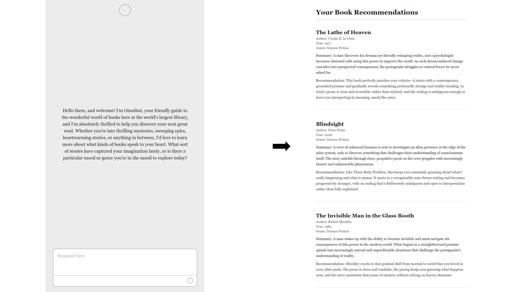
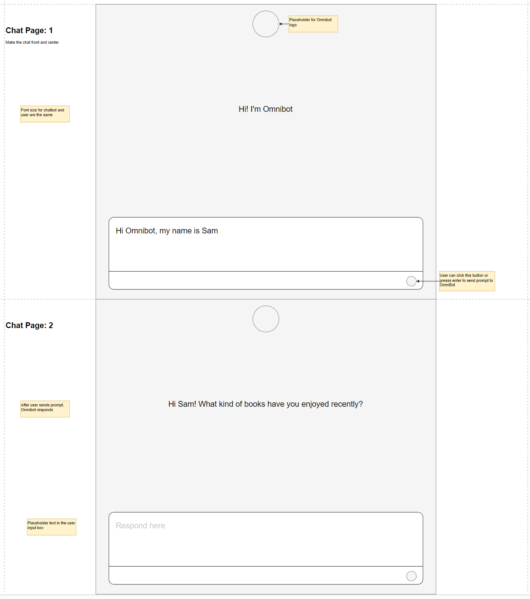
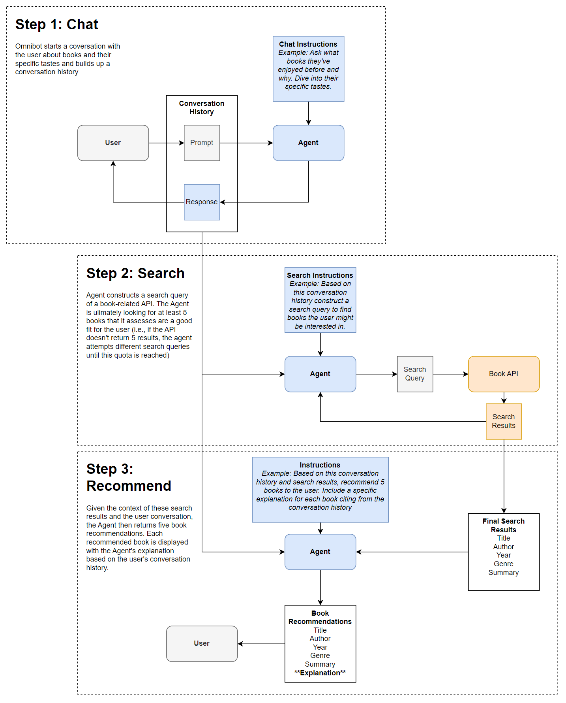

# Development Log

## 2026-03-16

Got Omnibot to work with an Open Library API to get book recommendation results and then switched the model from Claude Haiku to Ollama llama3.1-8bd

My quick observation is that llama3.1's conversation style is a bit different from Claude:

- Claude usually tries to understand the keyword/themes of my interests and rarely suggests or asks if I read a specific work during my conversation
- Ollama constantly asks "have you read this... or ..." which to me as a newbie reader gets annoying after awhile

The other thing I'm noticing is that since my app relies on the LLM to generate JSON formatted responses for book title, author, etc...well Ollama sometimes doesn't spit out exactly the right format (missing curly brackets and whatnot).

More RAG-related experiments to come later this week, but that's it for now

## 2026-03-15

"Step 1: Chat" is complete with very rough "LLM-only" versions of Step 2 and 3 completed as well. Basically an LLM alone can perform a "search-and-recommend" function all on its own because it has knowledge of books and can use the entire `conversation history + system prompt` to generate a JSON of recommended book titles, authors, summaries, etc.



The key task now is to introduce the Open Library API, where the LLM agent should instead query to confirm that books it has in mind do exist and aren't hallucinations. In LangGraph terms, the basic state graph has nodes `chat -> search -> recommend` with `search` node being useless/redundant/filled with placeholder code. So now that `search` node needs API search functions added.

Later I'll also look into the "Open Library MCP server" way of doing that but that's it for now to implement "Step 2: Search" in the diagram I drew up.

## 2026-03-13

I sketched out a quick UI wireframe and gave it to Claude to just vibe code a new front end with fake chat messages pre-loaded.



Now the task is to introduce LangChain/LangGraph into the backend and update the front-end to display an LLM's responses.

## 2026-03-10

Figured I'd start over from the last rebuild that was mostly vibecoded. This time I want to keep the front-end to something minimal and focus more attention on the LLMs (Claude/Ollama) and agentic loops (RAG/MCP).

I first sketched out a pipeline flow chart diagraming the flow from user chat with the LLM to book recommendations based on some book-related API:



Then I brainstormed a few questions to ask Claude and research this stack:

```markdown
What book related APIs are likely useful to use for this pipeline? Do a search and recommend your top 3.
- Please include in your recommendations of APIs the likely cost per request or cost to use an API key.
- Note that I really only need a large database of book summaries for the agent to comb through. 
- Note that I also don't want to consider Google Books because I've tried it before and didn't find it all that useful for this kind of project. 

How can MCP servers be involved in this pipeline?

I'm aware that LangChain can be used for agentic coding. Please look up the latest documentation on LangChain/LangGraph to answer the following: Is this pipeline a good place to apply LangChain/LangGraph to? If so, explain. 
- Suggest alternatives to LangChain for this same pipeline, just for my general knowledge.

Can the Agent simply rely on Ollama as the main LLM under-the-hood? If so, what version of Ollama do you recommend for this pipeline?

How can RAG be used in this pipeline?
- Assume I'm already using LangGraph, what other libraries/frameworks will I need?
- How can I involve Haystack? (look up Haystack first)
- How can I involve LlamaIndex? (look up LlamaIndex first)
```

I include the pipeline diagram for each of those questions so there's some specific context to what I'm asking about.