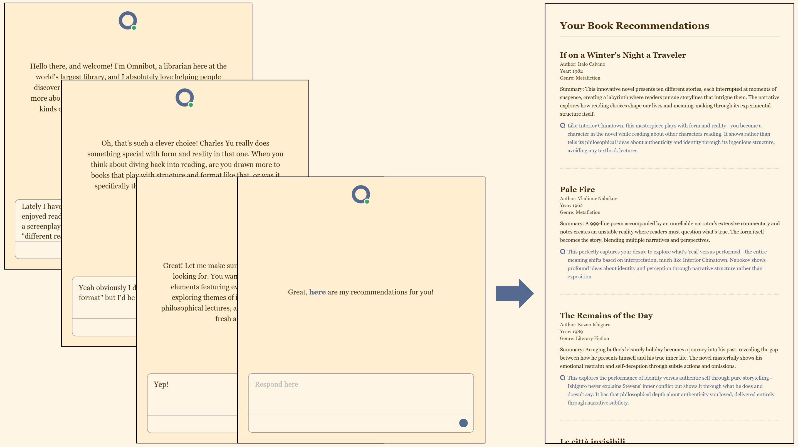
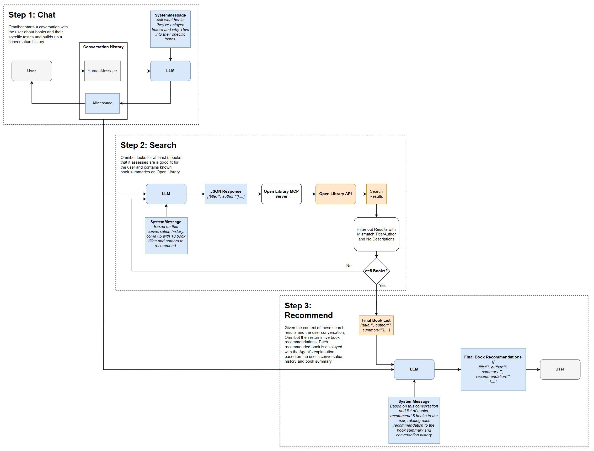

# 📚 omni_rebuild

An agent that makes book recommendations based on conversations with you about your nuanced preferences for stories. This is a rebuild of a [chatbot app](https://github.com/holistudio/project-omnibus) a friend and I made back before chatbots were cool, now with LLMs.

This project was motivated by the sense that people sometimes have very nuanced tastes in stories, writing styles, and characters (and...) in what they enjoy reading, to the point where their next read wouldn't be a quick search away. An conversation with an LLM could instead suss out a person's tastes for books and become the basis for a very personalized search and set of recommendations.

## 🧑‍🏫 User Experience



1. The user and *LLM* start chatting about the user's preferences for books, previous works they enjoyed, specific themes/characters/pacing/etc.
2. Before the conversation ends, the *LLM* summarizes back to the user a short description of what they are looking for in their next read.
3. The user is directed to another page of recommendations. Each book recommendation comes with a specific blurb by the *LLM* on why this book was recommended, tying back to specific moments in the user's conversation.

## 🤖 Backend



0. Behind the scenes, system prompts steer the *LLM* to asked pointed questions about the user's taste and only stop the conversation after re-iterating back to the user their overall preferences and the user appears to agree.
1. Based on the conversation, the *LLM* comes up with a list of 10 book titles and authors.
2. For each book the *LLM* comes up with, a search via Open Library MCP server and API is performed to check if that book exists and has a known summary/description. Step 1 is repeated if the final list of books hasn't reached 5 unique books total.
3. With this final list of book summaries and the entire user conversation in its context window, the *LLM* picks 5 books and attaches its own recommendation explanation for each one.
4. The final recommendations are then displayed to the user in a separate page.

## 🛠️ Set Up

0. Prerequisites:
   - Claude API key OR Ollama
   - Node.js

    Create a `.env` file in `backend/`:

    ```env
    LLM_PROVIDER=anthropic
    ANTHROPIC_API_KEY=sk-ant-your-key-here

    # or

    LLM_PROVIDER=ollama
    OLLAMA_MODEL=llama3.1
    OLLAMA_BASE_URL=http://localhost:XXXX

    # MCP
    MCP_OPEN_LIBRARY_PATH=/path/to/mcp-open-library/
    NODE_PATH=/path/to/node
    ```
    
    Clone the [Open Library MCP](https://github.com/8enSmith/mcp-open-library)
    - Recommended: clone to home directory

    ```bash
    cd ~
    git clone https://github.com/8enSmith/mcp-open-library.git
    cd mcp-open-library
    npm install
    npm run build
    ```

1. Start a virtual environment

    ```bash
    conda create -n omnibot python=3.12 -y
    conda activate omnibot
    ```

2. Install backend dependencies

    ```bash
    cd backend
    (uv) pip install -r requirements.txt
    ```

3. Set up frontend

    ```bash
    cd frontend
    npm init -y
    npm install typescript esbuild --save-dev
    npx tsc --init
    ```

## 🧑‍💻 Usage

0. Make sure you are in this directory (`omni_rebuild`) and activate the virtual environment in **two terminals**
   
   ```bash
   conda activate omnibot
   ```

1. Terminal 1: Start Flask server backend

    ```bash
    cd backend
    python app.py
    ```

   Flask starts on `http://localhost:5000`

2. Terminal 2: Start frontend

    ```bash
    cd frontend
    python -m http.server 3000
    ```

3. Open browser to `http://localhost:3000`